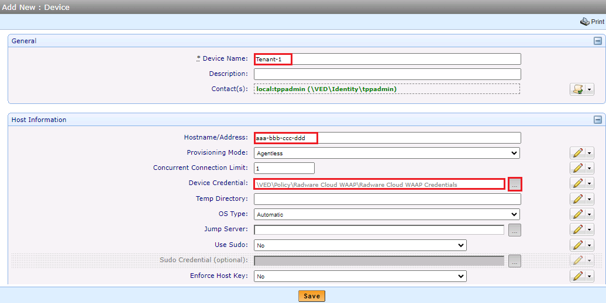

# How to Automate the Renewal SSL of Radware Cloud Web Application API Protection (Cloud WAAP) Using Venafi Platform

## Introduction:
Web application development is becoming increasingly complex and quick-paced. DevOps is increasing the level of functionality and frequency of product releases. With application availability more important to the user experience than ever, and with the growing complexity of the application environment and integrations, applications are becoming increasingly vulnerable, exposing enterprises to the risk of data breaches and financial loss.

Radware Cloud WAAP is a fully managed cloud application protection service providing the industry's most comprehensive web application security solution. The service integrates Radware's Cloud WAAP, API protection, bot management, client-side protection, and application layer DDoS protection in a single portal that provides security analytics, threat detection, and real-time security feeds to protect applications against hacking, malicious bots, API exposure, browser-side supply-chain attacks, DDoS attacks, OWASP Top 10, unknown and zero-day attacks, and other vulnerabilities. 
Refer this link for more information:
https://www.radware.com/products/cloud-waf-service/resources/

## Purpose:
Radware and Venafi have teamed up to make it easy to get started and fully automate the use of keys and certificates.

## Supported versions:
This driver script applies to Venafi TPP version 22.1 and above.

## Prerequisites:
Each certificate in the Cloud WAAP tenant managed by Venafi must have a unique Common Name (CN) across the tenant.

Each certificate in the Cloud WAAP tenant managed by Venafi should be associated with an application object in Venafi.

Cloud WAAP **API user**.

## How to use:

### Get the driver script:
Download the driver script from this repository or from Venafi's marketplace.

### Create Policy:
Open your Venafi platform and create a new policy, named **Radware Cloud WAAP** (or any other relevant name).

Click **Save**.

### Create Credentials Object:
Right-click on the device and navigate to **Add** --> **Credential** --> **Username Credential** and create a new credential object.

Under **General** fill in the **Credential Name** field with a relevant name.

Under **Settings** fill the **Expires** fields.

Under the **Credential** fill the following fields: **User Name**, **Password**, and **Confirm Password**.

Click **Save**.

Note --> this username & password should be an **API credential** for Cloud WAAP, contact Radware support if needed.

### Update Policy:
Click on the new policy and navigate to **Application** tab.

Under **Application Credential** bind the credential object that created in the previous stage.

Under the **PowerShell Script** choose the driver script.

Click **Save**.

### Create Device:
Right-click on the new policy and navigate to **Add** --> **Devices** --> **Device** to create a new device object.

Under **General** fill in the **Device Name** field with a relevant name.

Under **Host Information** fill the **Hostname/Address** field with the **Tenant ID** (contact Radware support if needed).

Click **Save**.

### Create Application:
Right-click on the device and navigate to **Add** --> **Application** --> **Adaptable** to create a new adaptable object.

Untick the **Processing Disabled** option to enable the application.

Under **Associated Certificate**, select the relevant certificate. If you do not have a certificate to associate, leave this field empty and create one in the next section.

Under **General** fill in the **Application Name** with a relevant name.

Under **Adaptable Settings**, fill in the **Placeholder Cert Common Name** field. This is used for applications created in the cloud without an appropriate certificate, allowing you to replace their certificate if needed.

Under **Self Signed**, select the desired value from the drop-down list.

Tick the **Enable Debug Logging** if needed, the logs saved in the Venafi **Logs** folder.

Click **Save**.

### Create Certificate - Optional:
**If you have not yet associated a certificate with the application, follow these example steps to create one, or contact Venafi support.**

Right-click on the **Application** and navigate to **Add** --> **Certificates** --> **Server Certificate** to create a new certificate object.

Under **General Information** fill the **Certificate Name** with a relevant name.

Change the **Management Type** to **Provisioning**

Under **Subject DN** provide the certificate **Common Name**.

**Optional:** Under **Subject Alt Name(s)** add more domains entries.

Choose the **CA Template**

Click **Save**

Navigate back to the Application and associate the created certificate.

### Run the solution:
**The environment is now ready to run the solution.**

Try pushing / renewing the certificate.

Open the Cloud WAAP GUI, navigate to Assets > Certificates, and use the search field to find the relevant certificate. Ensure that the newly uploaded certificate is present.

To view the Cloud WAAP logs, click on the **Activity Logs** icon at the top right.

## Automation Flow:
The Venafi platform uploads the certificate to the Radware Cloud WAAP.

All existing apps using the old certificate will be reassigned to the new certificate.

If there are applications under the **Placeholder Cert Common Name** with main domains that match the common name (CN) or subject alternative name (SAN) in the new certificate (including wildcard entries with an asterisk), the driver script will rebind them to the new certificate.

Updating the SNI certificate groups if necessary.

Deleting the old certificate.

## Disclaimer:
This script is for use at your own choice.
The script is provided as is without any warranty of any kind and Radware disclaims any and all liability regarding any use of the script.
